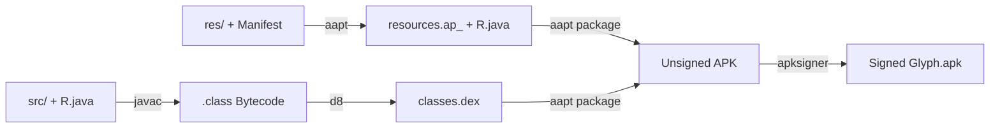

# Glyph: Artistic Home Screen Widgets

Glyph is an Android home screen widget app engineered from the ground up with a pure 2D Canvas Compositor engine. This repository contains the source code, architecture, and toolchain for Glyph (`com.glyph.widget`).

---

## Android Application Architecture & File Structure

An Android application is packaged as an Android Package (`.apk`), which is essentially a specialized zip archive containing compiled code, packaged resources, assets, certificates, and an application manifest.

Below is the foundational anatomy and file structure of an Android application:

```
glyph/
├── AndroidManifest.xml          # The application blueprint and OS contract
├── README.md                    # Project documentation and architectural guide
├── build.sh                     # Compilation, dexing, packaging, and signing pipeline
├── res/                         # Application resources (compiled by AAPT)
│   ├── drawable/                # Vector drawables, layer-lists, and shape XMLs
│   ├── layout/                  # User interface layouts and RemoteViews hierarchies
│   │   ├── activity_main.xml    # In-app settings and configuration screen
│   │   └── glyph_widget.xml     # Launcher widget RemoteViews container
│   ├── mipmap-xxxhdpi/          # App and launcher icons at various DPI densities
│   ├── values/                  # Reusable scalar values
│   │   ├── colors.xml           # Semantic color palettes and theme defaults
│   │   ├── dimens.xml           # Margins, paddings, corner radii, and text sizes
│   │   ├── strings.xml          # Translatable text strings and UI labels
│   │   └── styles.xml           # UI themes and component styling
│   └── xml/                     # System-level metadata descriptors
│       └── glyph_widget_info.xml# AppWidgetProviderInfo configuration
└── src/                         # Application source code
    └── com/glyph/widget/        # Package namespace (com.glyph.widget)
        ├── MainActivity.java    # Configuration Activity & interactive customization
        ├── GlyphWidgetProvider.java # BroadcastReceiver managing widget lifecycle
        ├── GlyphPrefs.java      # SharedPreferences management & state persistence
        ├── GlyphTheme.java      # Theme definitions and color palette matrices
        └── compositor/          # Pure 2D Canvas rendering engine
            ├── WidgetCanvas.java    # High-DPI bitmap drawing pipeline
            ├── CalendarRenderer.java# Artistic calendar styles & layout geometry
            └── ClockRenderer.java   # Single-line stylized clock typographies
```

---

## Detailed Breakdown of Core Android Components

### 1. The Manifest (`AndroidManifest.xml`)
The `AndroidManifest.xml` file is the fundamental declaration required by the Android operating system. It sits at the root of the project and informs the OS about:
* **Package Identity**: Unique reverse-DNS package identifier (e.g., `com.glyph.widget`).
* **SDK Compatibility**: `minSdkVersion` (minimum supported Android version, e.g. API 21 for Android 5.0+) and `targetSdkVersion` (target Android version, e.g. API 33 for Android 13).
* **Permissions**: System capabilities requested by the app.
* **Application Components**:
  * **Activities**: UI windows the user can interact with (`MainActivity`).
  * **BroadcastReceivers**: Components listening to system or app-specific broadcasts (`GlyphWidgetProvider` listening for `ACTION_APPWIDGET_UPDATE`, time ticks, or custom broadcast actions).
  * **Metadata**: Links connecting the AppWidgetReceiver to its XML metadata specification.

---

### 2. The Resource Hierarchy (`res/`)
All non-code assets and UI declarations reside in the `res/` directory and are assigned integer resource IDs by the Android Asset Packaging Tool (`AAPT`) in the generated `R.java` class:

* **`res/layout/`**:
  * In standard Android apps, layouts define the View hierarchy rendered by the GPU within the app's process.
  * In **Widget applications**, widget layouts run inside the **Home Screen Launcher process**, not the app process. Therefore, they must use `RemoteViews`, a cross-process IPC mechanism limited to a specific subset of Android layouts (`FrameLayout`, `LinearLayout`, `RelativeLayout`) and basic views (`ImageView`, `TextView`).
* **`res/xml/`**:
  * Used for XML configuration files. For home screen widgets, `res/xml/glyph_widget_info.xml` defines the `<appwidget-provider>` attributes:
    * `minWidth` and `minHeight`: Default grid cell size on the home screen.
    * `updatePeriodMillis`: Periodic update interval requested from the OS.
    * `resizeMode`: Whether the user can resize the widget horizontally, vertically, or both (`"horizontal|vertical"`).
    * `widgetCategory`: Placement target (`"home_screen"`).
* **`res/values/`**:
  * XML files containing structured values such as strings (`strings.xml`), colors (`colors.xml`), and dimensions (`dimens.xml`). Decoupling these from code ensures maintainability and internationalization.
* **`res/drawable/` & `res/mipmap/`**:
  * Graphic assets, vector XMLs, and multi-density application icons (`mdpi`, `hdpi`, `xhdpi`, `xxhdpi`, `xxxhdpi`).

---

### 3. Source Code (`src/`)
The Java source code implements the application logic:

* **`MainActivity.java`**: The entry point launched from the application drawer. Houses the customization controls (sliders for 4-side margins, border thickness, color gamut pickers, and style selectors) and provides real-time canvas preview.
* **`GlyphWidgetProvider.java`**: An extension of `AppWidgetProvider` (which inherits from `BroadcastReceiver`). It receives system callbacks when widgets are placed, resized, updated, or removed from the home screen.
* **`GlyphPrefs.java`**: Centralized persistence layer reading and writing user preferences using Android's lightweight XML key-value store (`SharedPreferences`).
* **`GlyphTheme.java`**: Structured catalog of 26+ curated color palettes, storing complementary background, border, calendar, and clock colors.
* **2D Canvas Compositor**:
  * Instead of relying on rigid, clunky XML View hierarchies that suffer from multi-line text wrapping or clipping during resize, the compositor renders the complete widget (background pill, borders, calendar grid, and clock digits) onto a high-resolution 2D `android.graphics.Canvas` and transfers the resulting `Bitmap` directly to the launcher via `RemoteViews.setImageViewBitmap()`.

---

## The Android Build & Compilation Pipeline

Building an installable Android APK from source involves four distinct stages:



1. **AAPT (Resource Compilation)**:
   * Parses `AndroidManifest.xml` and validates all XML files in `res/`.
   * Assigns numeric resource identifiers and outputs `R.java`.
   * Compiles XML assets into binary format and packages them into `resources.ap_`.

2. **Javac (Java Compilation)**:
   * Compiles all `.java` source files alongside `R.java` against the Android SDK platform JAR (`android.jar`).
   * Produces standard JVM `.class` bytecode files.

3. **D8 (Dexing)**:
   * Translates Java 8+ `.class` bytecode into Dalvik Executable (`classes.dex`) format, optimized for Android's ART (Android Runtime).

4. **APK Packaging & Signing (AAPT & APKSigner)**:
   * Merges `classes.dex` and `resources.ap_` into a single archive (`.apk`).
   * Aligns archive entries to 4-byte boundaries for memory-mapped I/O efficiency.
   * Cryptographically signs the APK with an RSA keystore using v2 and v3 signature schemes, enabling direct installation on Android devices.

---

## Development Roadmap (Commit by Commit)

* [x] **Commit 1**: Architecture & File Structure README
* [x] **Commit 2**: Basic Installable App & Permissions (`Glyph.apk` bundle)
* [x] **Commit 3**: Multi-Widget Architecture Entry (Clock & Calendar Widget)
* [x] **Commit 4**: Widget Background Pill & 4-Side Independent Margin Controls
* [x] **Commit 4.1**: Multi-Widget Listing Hub & Per-Widget Isolated Margin Controls
* [x] **Commit 5**: 25+ Background Color Themes (Dual Text & Border Defaults)
* [x] **Commit 6**: 26th Theme - Frosted Glass & Intensity Slider *(Current)*
* [ ] **Commit 7**: Border Customizer (sRGB Color Gamut & 0 to Very Thick Slider)
* [ ] **Commit 8**: Movable & Resizable Test Calendar Foundation
* [ ] **Commit 9**: Multiple Artistic Calendar Styles (11 Reference Variants)
* [ ] **Commit 10**: Two-Tone Calendar sRGB Gamut Customizer
* [ ] **Commit 11**: Movable & Resizable Test Clock Foundation
* [ ] **Commit 12**: Multiple Artistic Clock Styles (12 Reference Variants)
* [ ] **Commit 13**: Clock Two-Tone sRGB Gamut Customizer
* [ ] **Commit 14**: In-App UI/UX Aesthetic Redesign
